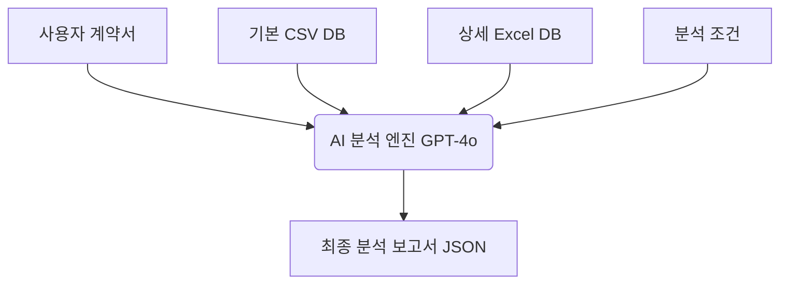

# AI 분석 서버 전달 데이터 구조 (AI Analysis Context)

이 문서는 근로계약서 분석 시 **AI(GPT-4o)에게 전달되는 모든 정보의 구조와 내용**을 설명합니다.

## 시스템 프롬프트 (Role & Task)
- **페르소나**: 근로계약서 적법성 검토 전문가 (부드러운 조언 말투 사용)
- **임무**: 사용자가 제출한 텍스트와 참조 DB를 대조하여 위법성 및 누락 사항 검토
- **출력 형식**: 정해진 JSON 구조 (항목, 적절성, 판단이유, 발견내용, 법적근거, 개선권고)

## 사용자 메시지 (Context)

AI는 다음과 같은 네 가지 주요 영역의 데이터를 입력받아 분석을 수행합니다.

### 1. 분석 조건 (Conditions)
사용자가 선택한 사업장 규모와 근로자 유형 정보를 전달합니다.
- **규모**: `5인 이상` 또는 `5인 미만`
- **유형**: `일반직`, `기간제`, `단시간(알바)` 등

### 2. 계약서 전문 (Input Text)
OCR을 통해 추출되고 사용자가 수정한 **근로계약서의 원본 텍스트** 전문입니다.

### 3. 참조 DB 1: 기본 지침 (Base Guidelines - CSV)
`근로계약서_updated.csv` 등에서 추출한 필수 기재 사항과 기본 검토 기준입니다.
- **항목**: 임금, 소정근로시간, 휴게시간 등
- **기재내용(기준)**: 해당 항목에 반드시 포함되어야 할 내용
- **필요이유**: 법적으로 해당 항목이 필요한 이유
- **관련법령**: 근거가 되는 주요 법 조항

### 4. 참조 DB 2: 상세 법령 및 판례 (Detailed DB - Excel)
CSV의 각 항목과 연관된 **30여 개의 상세 Excel 파일**에서 추출된 심층 데이터입니다.
- **상세 내용**: 법 조문 전문, 관련 판례 요약, 행정해석(질의회시), 실무 매뉴얼 내용
- **최적화**: 토큰 한도를 초과하지 않도록 **중복을 제거**하고 핵심 내용을 각 2,000자 이내로 요약하여 전달합니다.

---

## 데이터 흐름 시각화

## 보안 알림
- 분석에 사용되는 모든 텍스트는 법률 검토용으로만 일회성으로 사용되며, 외부로 유출되거나 AI 학습용으로 저장되지 않습니다.
