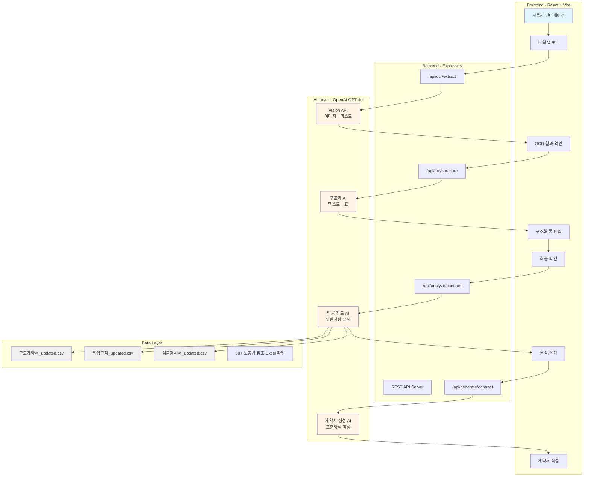
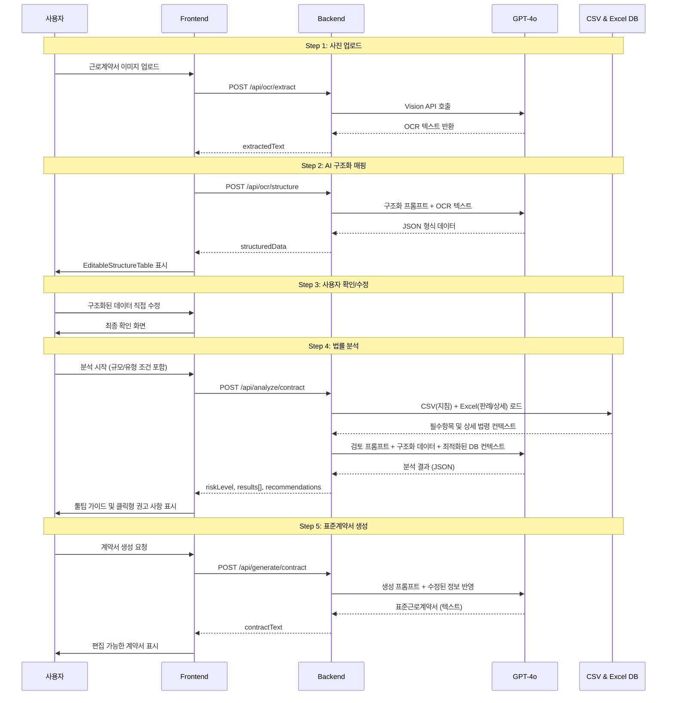
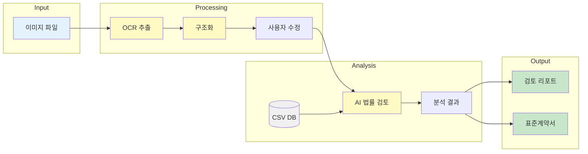

# 시스템 아키텍처 - 노동법 자율점검 AI

## 전체 시스템 구조



## 워크플로우 (5단계)



## 기술 스택

### Frontend
- **Framework**: React 18 + Vite
- **UI Library**: Framer Motion (애니메이션)
- **Icons**: Lucide React
- **Styling**: Vanilla CSS (index.css)
- **State Management**: React Hooks (useState)

### Backend
- **Runtime**: Node.js
- **Framework**: Express.js
- **File Upload**: Multer (메모리 스토리지)
- **AI Integration**: OpenAI SDK (GPT-4o)
- **Environment**: dotenv

### AI Models
- **Vision**: GPT-4o (이미지 OCR)
- **Text Processing**: GPT-4o (구조화, 분석, 생성)

### Data
- **Format**: CSV (UTF-8)
- **Files**: 3개 주요 CSV + 30개 참조 Excel
- **Encoding**: 한글 지원

## 데이터 플로우



## 주요 컴포넌트

### Frontend Components
```
App.jsx
├── StepIndicator (진행 단계 표시)
├── Step 1: Upload (파일 선택 및 로딩 팁 표시)
├── Step 2: Structured (EditableStructureTable을 통한 정보 수정)
├── Step 3: Review (최종 확인)
├── Step 4: Result (Tooltip 및 클릭 상세 보기 적용된 결과)
└── Step 5: Contract (계약서 작성 및 데이터 보존)
```

### Backend Endpoints
```
server/index.js
├── POST /api/ocr/extract (OCR 추출)
├── POST /api/ocr/structure (구조화)
├── POST /api/analyze/contract (법률 분석)
└── POST /api/generate/contract (계약서 생성)
```

### AI Prompts
```
1. Vision Prompt (OCR)
   - 문서 디지털화 전문가
   - 모든 텍스트 정확 추출
   
2. Structure Prompt (구조화)
   - 9개 섹션 매핑
   - 미기재/판독불가 표시
   
3. Analysis Prompt (검토)
   - 적법성 검토 전문가
   - 3단계 검토 로직
   - DB 기반 근거 제시
   
4. Generation Prompt (생성)
   - 표준양식 작성
   - 위반사항 자동 보완
```

## 보안 및 성능

### 보안
- ✅ 환경변수로 API 키 관리 (.env)
- ✅ CORS 설정
- ✅ 파일 업로드 메모리 제한
- ✅ 이미지 타입 검증 (accept="image/*")

### 성능
- ⚡ 멀티파일 병렬 OCR 처리
- ⚡ 프로그레스 바로 사용자 피드백
- ⚡ 메모리 스토리지 (디스크 I/O 최소화)
- ⚡ 클라이언트 사이드 이미지 프리뷰

## 확장 가능성

### 향후 개선 가능 항목
1. **데이터베이스**: CSV → PostgreSQL/MongoDB
2. **인증**: 사용자 로그인 및 히스토리 관리
3. **캐싱**: Redis로 분석 결과 캐싱
4. **파일 저장**: S3/Cloud Storage 연동
5. **실시간**: WebSocket으로 진행 상황 스트리밍
6. **다국어**: i18n 지원
7. **모바일**: 반응형 디자인 강화
